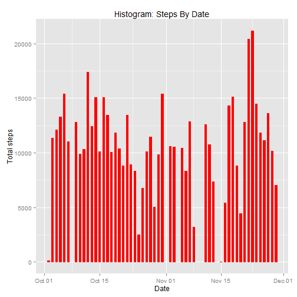
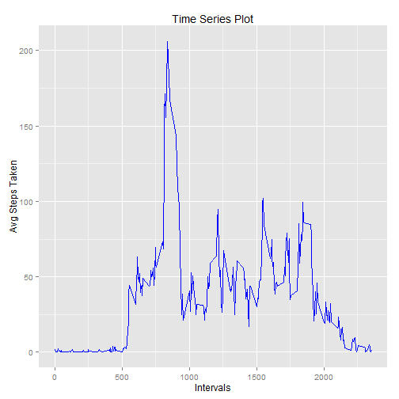
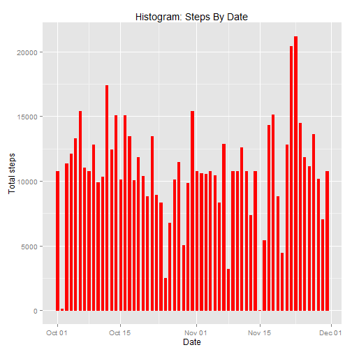
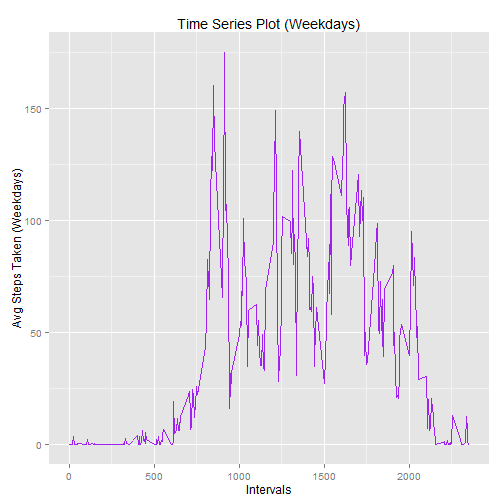
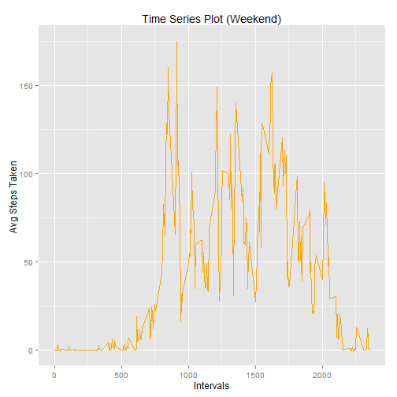

Reproducible Research: Peer Assessment 1
==========================================

## Loading and processing the data

Show any code that is needed to  

1. Load the data (i.e. read.csv())  
2. Process/transform the data (if necessary) into a format suitable for your analysis  


```r
# Initialize libraries and options
library(ggplot2)
echo = TRUE  

# Load Dataset, remove NA Values and relable rows
data <- read.csv("activity.csv", colClasses = c("integer", "Date", "factor"))
data <- na.omit(data) 
```

## What is mean total number of steps taken per day?

For this part of the assignment, you can ignore the missing values in the dataset.  

1. Calculate the total number of steps taken per day  

```r
ggplot(data, aes(date, steps)) + geom_bar(stat = "identity", colour = "red", fill = "red", width = 0.5) +  
  labs(title = "Histogram: Steps By Date", x = "Date", y = "Total steps")
```

 

2. If you do not understand the difference between a histogram and a barplot, research the difference between them. Make a histogram of the total number of steps taken each day  

3. Calculate and report the mean and median of the total number of steps taken per day  

```r
aggData <- aggregate(data$steps, list(Date = data$date), FUN = "sum")
colnames(aggData) <- c("Date", "Step")
paste("Mean Steps: ",mean(aggData$Step))
```

```
## [1] "Mean Steps:  10766.1886792453"
```

```r
paste("Median Steps: ", median(aggData$Step))
```

```
## [1] "Median Steps:  10765"
```

## What is the average daily activity pattern?

1. Make a time series plot (i.e. type = "l") of the 5-minute interval (x-axis) and the average number of steps taken, averaged across all days (y-axis)  

```r
avgSteps <- aggregate(data$steps, list(interval = as.numeric(as.character(data$interval))), FUN = "mean")
names(avgSteps)[2] <- "AvgSteps"
ggplot(avgSteps, aes(interval, AvgSteps)) + geom_line(color = "blue", size = 0.5) + labs(title = "Time Series Plot", x = "Intervals", y = "Avg Steps Taken")
```

 

2. Which 5-minute interval, on average across all the days in the dataset, contains the maximum number of steps?  

```r
maxInterval <- subset(avgSteps, AvgSteps==max(avgSteps$AvgSteps)) # Note to self, column and dataset names should not match
maxInterval
```

```
##     interval AvgSteps
## 104      835 206.1698
```

## Imputing missing values

Note that there are a number of days/intervals where there are missing values (coded as NA). The presence of missing days may introduce bias into some calculations or summaries of the data.

1. Calculate and report the total number of missing values in the dataset (i.e. the total number of rows with NAs)  

```r
NAData <- read.csv("activity.csv", colClasses = c("integer", "Date", "factor"))
sum(is.na(NAData))
```

```
## [1] 2304
```

2. Devise a strategy for filling in all of the missing values in the dataset. The strategy does not need to be sophisticated. For example, you could use the mean/median for that day, or the mean for that 5-minute interval, etc.  
  * Will use a for loop to substitute the avgSteps (mean) for the interval in any NA value
3. Create a new dataset that is equal to the original dataset but with the missing data filled in.  

```r
for (i in 1:nrow(NAData)) {
  if (is.na(NAData$steps[i])) {
    NAData$steps[i] <- avgSteps[which(NAData$interval[i] == avgSteps$interval), ]$AvgSteps
  }
}
```

4. Make a histogram of the total number of steps taken each day and Calculate and report the mean and median total number of steps taken per day. Do these values differ from the estimates from the first part of the assignment? What is the impact of imputing missing data on the estimates of the total daily number of steps?  

```r
ggplot(NAData, aes(date, steps)) + geom_bar(stat = "identity", colour = "red", fill = "red", width = 0.5) +  
  labs(title = "Histogram: Steps By Date", x = "Date", y = "Total steps")
```

 

```r
aggNAData <- aggregate(NAData$steps, list(Date = NAData$date), FUN = "sum")
colnames(aggNAData) <- c("Date", "Step")
paste("Mean Steps: ",mean(aggNAData$Step))
```

```
## [1] "Mean Steps:  10766.1886792453"
```

```r
paste("Median Steps: ", median(aggNAData$Step))
```

```
## [1] "Median Steps:  10766.1886792453"
```
  * The mean did not change.
  * The median is now equal to the mean. This is a small increase.

## Are there differences in activity patterns between weekdays and weekends?

For this part the weekdays() function may be of some help here. Use the dataset with the filled-in missing values for this part.

1. Create a new factor variable in the dataset with two levels ??? ???weekday??? and ???weekend??? indicating whether a given date is a weekday or weekend day.  

```r
data$Weekday <- factor(weekdays(data$date))
levels(data$Weekday) <- list(weekday = c("Monday", "Tuesday",
                                             "Wednesday", 
                                             "Thursday", "Friday"),
                                 weekend = c("Saturday", "Sunday"))
```

2. Make a panel plot containing a time series plot (i.e. type = "l") of the 5-minute interval (x-axis) and the average number of steps taken, averaged across all weekday days or weekend days (y-axis). See the README file in the GitHub repository to see an example of what this plot should look like using simulated data.  

```r
# Subset the data for weekdays and weekends
weekdays <- data[data$Weekday=="weekend", ]
weekends <- data[data$Weekday=="weekend", ]

# Calculate the average steps by interval for weekdays and plot

avgSteps <- aggregate(weekdays$steps, list(interval = as.numeric(as.character(weekdays$interval))), FUN = "mean")
names(avgSteps)[2] <- "AvgSteps"
ggplot(avgSteps, aes(interval, AvgSteps)) + geom_line(color = "purple", size = 0.5) + labs(title = "Time Series Plot (Weekdays)", x = "Intervals", y = "Avg Steps Taken (Weekdays)")
```

 

```r
# Calculate the average steps by interval for weekdays and plot

avgSteps <- aggregate(weekends$steps, list(interval = as.numeric(as.character(weekends$interval))), FUN = "mean")
names(avgSteps)[2] <- "AvgSteps"
ggplot(avgSteps, aes(interval, AvgSteps)) + geom_line(color = "orange", size = 0.5) + labs(title = "Time Series Plot (Weekend)", x = "Intervals", y = "Avg Steps Taken ")
```

 
